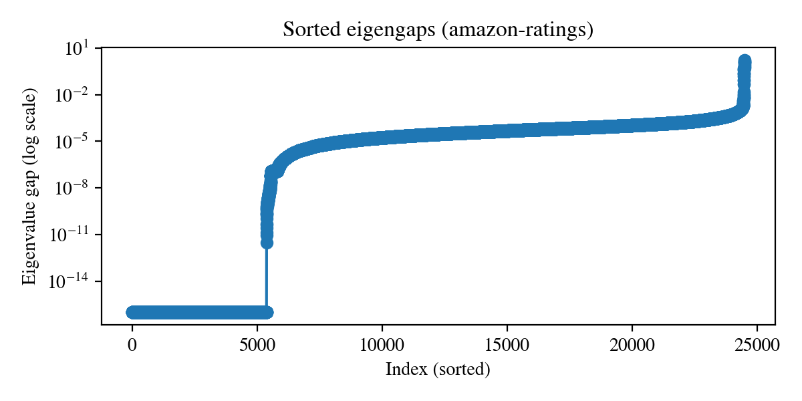
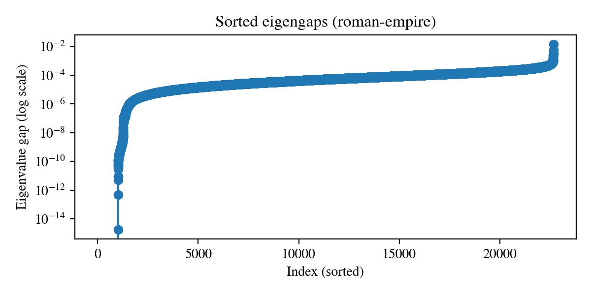
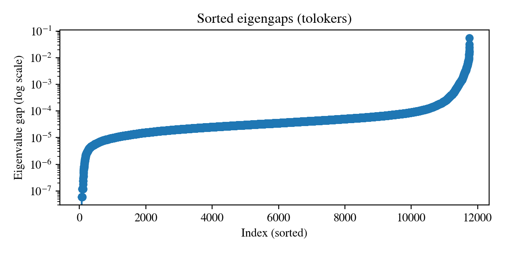
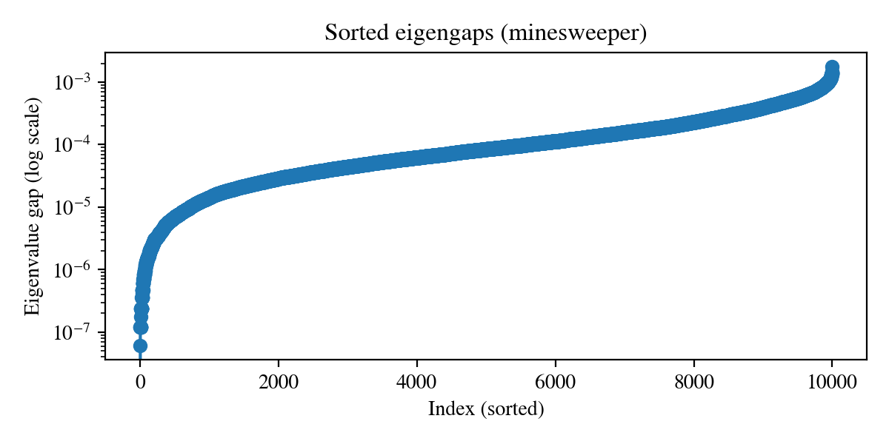

## Eigenvalue Gap Analysis

We analyze the sorted eigenvalue gaps of the normalized Laplacian across datasets. This provides insight into spectral degeneracy (repeated eigenvalues) and near-degeneracy (clusters of very small gaps).

### Amazon-Ratings

---

### Roman-Empire

---

### Tolokers

---

### Minesweeper

---

**Our method remains robust**, as it does not rely on a strictly unique or well-separated eigenvalues, operating instead in a deflated representation.
