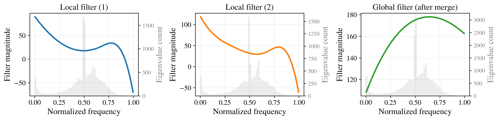
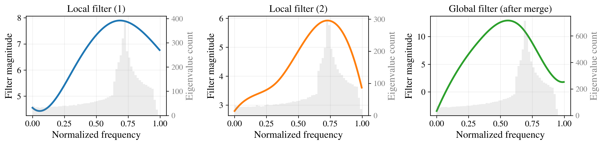
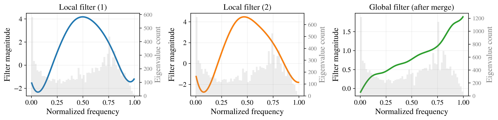
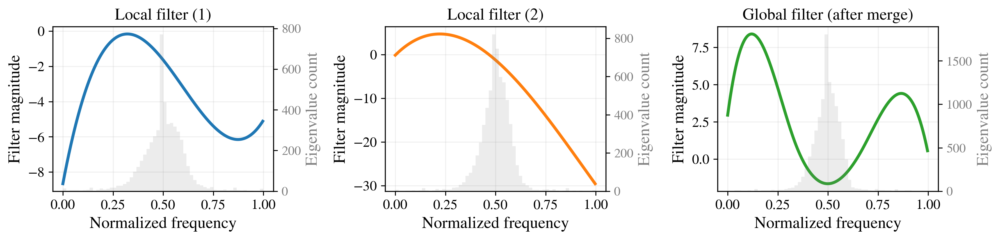

# Spectral filter responses

We visualize the learned spectral filters (averaged across layers and channels) at different hierarchical levels.

---

## Amazon-Ratings

Filters emphasize low frequencies and a band in the medium-to-high range.  
This suggests that the model leverages both smooth global structure (low frequencies) and localized relational patterns (mid-to-high frequencies), consistent with category-level trends and co-purchase interactions.

---

## Minesweeper

Filters place most of their emphasis on high frequencies, consistent with the rapidly varying bomb placement across the grid.

---

## Roman-Empire

Roman-Empire exhibits low homophily.  
The composition of local and global filters results in a medium-to-high-pass response, reflecting the need to distinguish neighboring nodes with different labels.

---

## Tolokers

Filters attenuate mid-frequencies (where eigenvalue density is highest) while amplifying both low and high frequencies.  
This indicates that the model suppresses noisy mid-scale components and focuses on global community trends (low frequencies) and fine-grained local differences (high frequencies).
